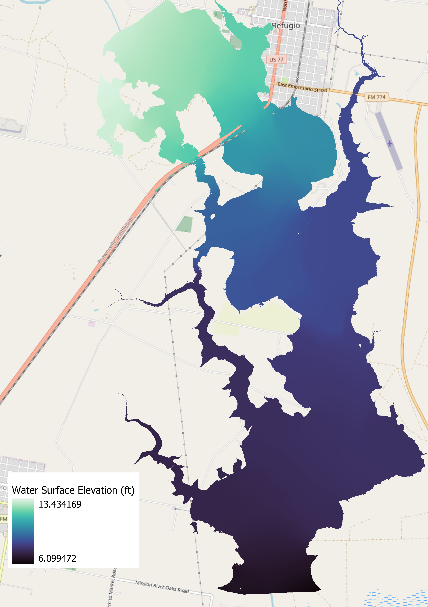
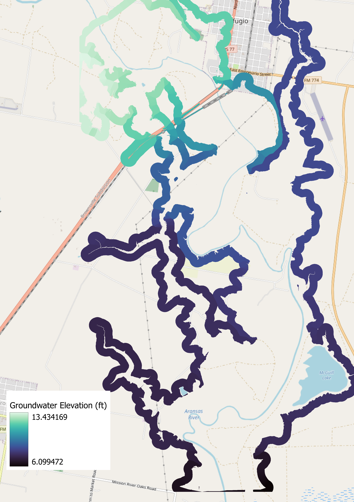

# Ground Water Raster Buffer - QGIS Plugin

Expands and interpolates edge values of Water Surface Elevation (WSE) rasters to produce groundwater (GW) buffer rasters. Requires a vector version of the WSE file. Below is an example of the plugin processing a 75 metre groundwater buffer around a WSE file:

*Data Source: FLUD Research Group, 2020, "Water Surface Elevations: Landcover +10% Roughness Scenario", https://doi.org/10.18738/T8/LBWRDQ, Texas Data Repository, V1*

## Installation

Currently, you can download the plugin from GitHub as a zip file and then use the 'Install from ZIP' tab in the plugin manager. The plugin was created for QGIS v. 3.22.8. Once installed, you should see this icon: .

## Issues

You may need to simplify and smooth the WSE vector file for best results; see [the QGIS Manual](https://docs.qgis.org/3.22/en/docs/user_manual/processing_algs/qgis/vectorgeometry.html?highlight=smooth#smooth). Generally, the [Raster to Polygon](https://pro.arcgis.com/en/pro-app/2.8/tool-reference/conversion/raster-to-polygon.htm) tool in ArcGIS Pro creates vector files that work well with the plugin, especially when the 'Simplify Polygons' option is checked.

If you encounter any other issues, please add a ticket to the'[issues](https://github.com/blairscriven/Groundwater-Buffer-Raster/issues)' tab.